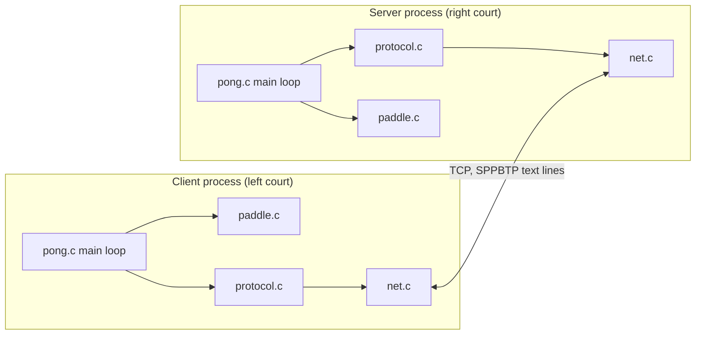
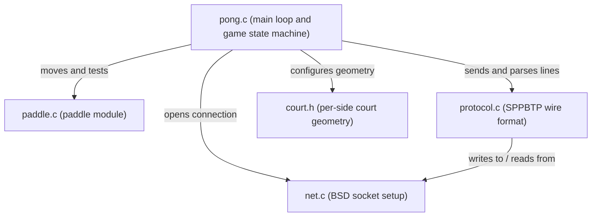
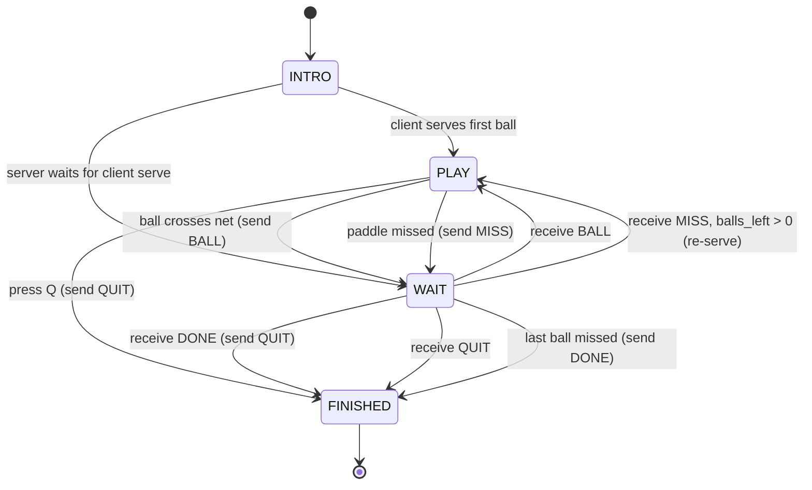

# netPong


A two-player networked Pong game for the terminal, written in C for Kent State CS4-53203 Systems Programming (Spring 2026).

## Overview

netPong started as the single-player Pong assignment from the course and grew into a two-player game that runs across a network. Two people start the program on two machines (or two terminals on one machine), and the ball travels between their courts over a TCP socket. One side launches as the server and the other connects as the client. After the handshake, both processes are equal: each one simulates the ball while it is on its own court, then serializes the ball and hands control to the other side when it crosses the net.

I built this in three phases. Phase 1 was analysis of the single-player baseline and how to split it. Phase 2 was the protocol and state-machine design. Phase 3 was the working C implementation with sockets, the wire format, and the play/wait state machine. The `docs/` folder keeps the report from each phase.

I keep one source tree at the repo root and use Git tags to mark milestones:

- `v0.1-original-pong` — the original single-player Pong baseline
- `v0.2-phase1-analysis` — Phase 1 architecture, RFC mapping, and design documentation
- `v0.3-phase2-design` — Phase 2 protocol and state-machine design
- `v1.0-phase3-netpong` — the finished two-player networked game

## Architecture

The two processes run the same binary. The server passes a single port argument; the client passes a host and a port. Inside each process the main loop in `pong.c` drives the paddle module, the protocol layer, and the socket layer.



The module split inside one process:



The game runs as a four-state machine. The local process owns the ball and the physics ticker only while it is in `PLAY`. In `WAIT` it stops the ticker and blocks on the socket until the peer sends the next message.



For the rationale behind these choices, see the [Architecture](../../wiki/Architecture) wiki page.

## Network Protocol

The two processes talk over TCP using SPPBTP, a line-oriented ASCII protocol from the course RFC. Each message is one CRLF-terminated line that starts with a four-character keyword: `HELO`, `NAME`, `SERV`, `BALL`, `MISS`, `DONE`, `QUIT`, or `?ERR`. I send lines with `dprintf` straight to the socket fd and read them with `fgets` through a buffered `FILE*` on a duplicated fd, so reads and writes never fight over the same buffer.

The game does not stream the full board every frame. The only state that crosses the wire during a rally is the ball, and it crosses once per net-crossing in a `BALL` line:

```
BALL net_position xttm yttm ydir [PPBchar]
```

`net_position` is the ball's row relative to the top of the net, `xttm`/`yttm` are the horizontal and vertical time-to-move counters that set its speed, and `ydir` is its vertical direction. The receiving side rebuilds a local ball from those fields, drops it in at its own net edge, and switches to `PLAY`. Paddles never travel over the socket; each side draws only its own paddle. Scores stay in sync because a `MISS` deterministically moves the point and the next serve to the other player.

The full packet layout and sync strategy are on the [Network Protocol](../../wiki/Network-Protocol) wiki page.

## Getting Started

### Build

You need a C compiler and the ncurses development headers. The terminal rendering uses curses, and the Makefile links `-lncurses`.

```bash
# Debian / Ubuntu
sudo apt-get install -y libncurses-dev

make
```

`make` builds the `pong` binary.

### Run

Start the server in one terminal with a port number:

```bash
./pong 2001
```

It prints `waiting for connection on port 2001...` and then waits.

Start the client in a second terminal with the server's host and the same port:

```bash
./pong localhost 2001
```

Both windows come up as soon as the TCP connection is established. The client serves the first ball.

### Keys

- `k` — move your paddle up
- `j` — move your paddle down
- `Q` — quit and tell the opponent

Keyboard input is active while the ball is on your court. While you wait for the ball to come back, the local keyboard is idle (see the Limitations note in the Phase 3 report).

## Project Structure

- `pong.c` — main loop, game state machine, ball physics, court drawing
- `paddle.c`, `paddle.h` — the paddle module: `paddle_init`, `paddle_up`, `paddle_down`, `paddle_contact`
- `net.c`, `net.h` — BSD socket setup: server bind/listen/accept and client connect
- `protocol.c`, `protocol.h` — the SPPBTP wire format: sender helpers and `recv_msg`
- `court.h` — `struct court` and `configure_side`, which set per-side geometry so one engine renders either court
- `Makefile` — builds the `pong` binary
- `docs/original/` — notes for the single-player baseline
- `docs/phase1/`, `docs/phase2/`, `docs/phase3/` — the report from each development phase
- `.github/workflows/ci.yml` — builds the binary on Ubuntu with ncurses installed

I kept the class handouts, submission files, and scratch folders out of the tracked repo, so the public project holds only source and documentation that I wrote.

## Roadmap

The project meets the assignment requirements. A few items from the RFC are documented as not implemented and would be the next work:

- Active keyboard during `WAIT` using `select()` or `poll()`, so `Q` registers immediately when the ball is on the other court.
- A server that returns to waiting after a game ends, instead of one game per launch.
- A `?ERR` recovery path that resynchronizes instead of closing the connection.

See the [Roadmap](../../wiki/Roadmap) wiki page for more.

## Author & Acknowledgments

Brandon Robare.

The single-player Pong assignment that this builds on was provided as the course baseline by the CS4-53203 instructor. The networking work — the socket layer, the SPPBTP protocol implementation, the play/wait state machine, and the per-side court refactor — is mine. The protocol follows the SPPBTP RFC handed out for the assignment.

## License

Released under the MIT License. See [LICENSE](LICENSE) and the [License](../../wiki/Home#license) note on the Wiki.
